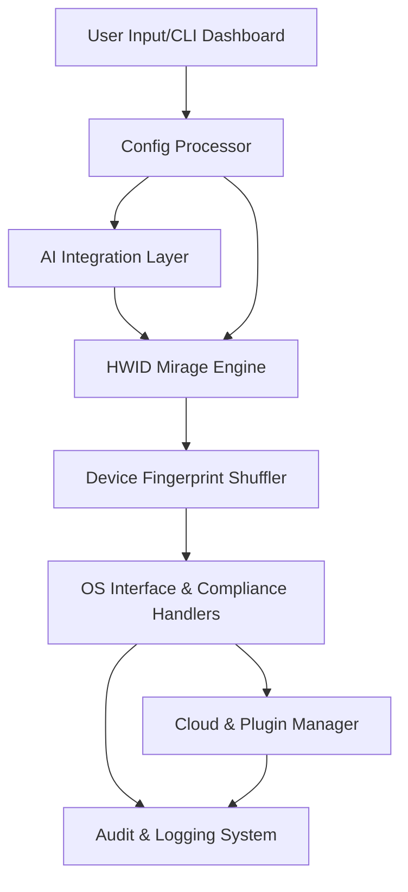

# Device Phantom - System Fingerprint & HWID Mirage Suite 🌐

Optimize your privacy to the fullest with **Device Phantom** – an ingeniously-crafted hardware identity mirage suite. Conceived as a next-generation evolution from classic hardware-protection tools, Device Phantom allows IT professionals, privacy enthusiasts, and digital adventurers to personalize, shuffle, and automate their entire system’s identity signature with precision.

Tailored for situations where discretion meets compliance, Device Phantom encapsulates advanced modules for device fingerprinting camouflage, HWID management automation, and seamless API integrations. This repository blends robust privacy operations with a responsive user interface, multilingual support, and around-the-clock client advisory for a true global footprint.

---

## 🚀 Table of Contents

- [🔰 Overview](#-overview)
- [🏆 Key Features](#-key-features)
- [🌎 OS Compatibility](#-os-compatibility)
- [🤖 OpenAI & Claude API Integrations](#-openai--claude-api-integrations)
- [🖥️ Example Profile Configuration](#-example-profile-configuration)
- [📟 Example Console Invocation](#-example-console-invocation)
- [📉 Mermaid Architecture Diagram](#-mermaid-architecture-diagram)
- [📝 Feature List & SEO Advantages](#-feature-list--seo-advantages)
- [🚦 Disclaimer](#-disclaimer)
- [📜 License](#-license)
- [⬇️ Download](#-download)

---

## 🔰 Overview

Welcome to **Device Phantom**, where system identity takes on a fluid, adaptive profile for your utmost privacy and operational separation. Device Phantom approaches privacy with a multi-pronged attack: unlike typical spoof suites, it offers customizable, persistent profiles, drag-and-drop device masking, and advanced HWID mirroring for virtual and bare metal devices.

Whereas traditional tools focus merely on masking, Device Phantom provides an orchestral suite of features designed for rapid deployment, granular adjustments, and safety guarantees, integrating with AI-driven APIs for automatic configuration recommendations.

---

## 🏆 Key Features

- 🖥️ **HWID Mirage Engine:** Invent, rotate, and automate hardware ID changes for CPU, GPU, drives, NIC cards, and peripherals.
- 📲 **Device Fingerprint Shuffler:** Randomize or select from a library of real-world device footprints.
- 💡 **AI-Assisted Profile Suggestions:** Integrates with OpenAI and Claude APIs for tailored device masking strategies based on scenario prompts.
- 🌐 **Responsive UI:** From mobile to widescreen, every pixel adapts to your needs, with visual status indicators.
- 🗣️ **Multilingual Support:** Built-in UI and CLI localization for English, Español, Deutsch, Русский, 中文, العربية, and more.
- ⏱️ **24/7 Client Assistance:** Automated bot and ticket-based support ensure help is always one tap away.
- 🔒 **Persistent & Ephemeral Profiles:** Choose between one-off runs or long-term masked sessions.
- 💽 **Cloud Profile Storage:** Safely save, sync, and revert configuration sets with encrypted storage options.
- 📦 **Modular Plugin Architecture:** Extend or customize functionality via community plugins.
- ⚙️ **Compliance Ready:** Designed for research, enterprise, and lawful privacy use cases – not just individual or casual needs.

---

## 🌎 OS Compatibility

| Platform         | Supported |
|------------------|:---------:|
|  | ✅ |
|  | ✅ |
|  | ✅ |
|  | 🟡 (partial suite) |
|  | 🟡 (partial suite) |

---

## 🤖 OpenAI & Claude API Integrations

Device Phantom leverages powerful language-model APIs to deliver context-aware device and HWID profile suggestions. Using your specified use-case (e.g., “appear as a UK-based office laptop circa 2022”), the suite auto-generates plausible yet unique device signatures.

**OpenAI & Claude Use Cases:**

- Auto-generate compliant device profiles per region or application requirement
- Generate, refine, and validate randomized HWID combinations
- On-demand documentation or script help within your current locale
- Scenario simulation: test fingerprint detection tools against randomized mirages

**How to Connect:**

1. Supply your API key(s) in `phantom-config.yaml`.
2. Select “AI Profile Assist” within the dashboard.
3. Command or prompt the system for context-specific recommendations.

---

## 🖥️ Example Profile Configuration

A sample YAML profile used with Device Phantom:

    profile_name: "Mobile_OPS_April2026"
    device_template:
      cpu: "Intel Core i7-12700K"
      gpu: "NVIDIA RTX 3080"
      network_interface: "Killer E2600"
      serial_numbers:
        motherboard: "AB9CXY1234567890"
        bios: "1.9XG3A2026"
        disk: "WD5000LPLX-0"
    system_locale: "en_GB"
    persist: true
    ai_assist: true
    notes: "For testing anti-fraud systems in EU region"
    plugins_enabled:
      - cloud_sync
      - audit_logger

---

## 📟 Example Console Invocation

    # Initialize Device Phantom with a specified profile and verbose logging
    $ device-phantom --profile Mobile_OPS_April2026.yaml --log-level debug --cloud-sync

---

## 📉 Mermaid Architecture Diagram

---

## 📝 Feature List & SEO Advantages

- **Advanced hardware ID automation** minimizing platform traceability
- **Adaptive system fingerprinting** for privacy-driven research
- **User-friendly, multilingual interface** ensuring global accessibility
- **Real-time AI guidance** for configuration and risk assessment
- **Enterprise & compliance-ready** designs for research and authorized device management
- **Cloud-enabled profile storage** for synchronized, fail-safe restoration
- **Modular, open-source plugin system** facilitating extensibility
- **SEO-Optimized:** Search phrases like “advanced HWID solutions”, “AI-powered device masking”, or “compliance-focused device fingerprinting” will discover Device Phantom as the leading edge for privacy system automation in 2026 and beyond

---

## 🚦 Disclaimer

**Device Phantom** is a professional research and enterprise privacy utility. Only use the suite in accordance with all relevant laws, regulations, and organizational policies. This software is provided as-is, intended for legal and ethical purposes such as compliance testing, software development, and privacy R&D.

---

## 📜 License

This repository is licensed under the MIT License.  
[View the License](./LICENSE)

---

## ⬇️ Download

Ready to get started with advanced system fingerprinting?  
Download Device Phantom Suite:

---

© Device Phantom — A Next-Generation HWID & Fingerprint Mirage Suite | 2026